# Commit.

**Put money on your goals. Miss one, and your stake goes to charity.**

Most of us know what we should be doing. We just don't do it. Commit gives you a reason to follow through: you pick a task, set a deadline, and put a few dollars on it. Finish on time and you keep your money. Miss it and the stake is donated to a charity you chose.

You prove each task with a quick photo, so it's honest, and you can't tick things off from the sofa.

  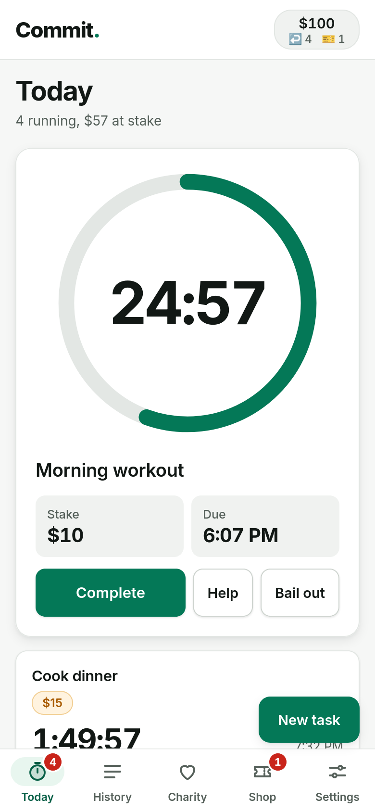
  &nbsp;
  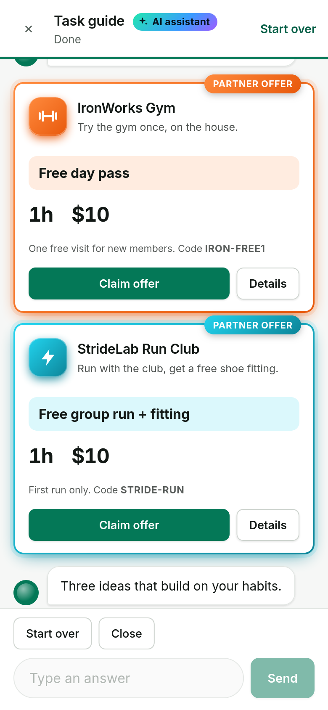
  &nbsp;
  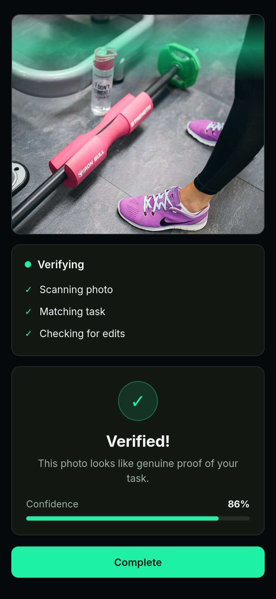

---

## How it works

1. **Pick a task.** Something small and real: go to the gym, cook dinner, read 20 pages.
2. **Stake some money.** Choose how much it's worth to you, and how long you have.
3. **Do it, and snap a photo.** Take a picture as proof.
4. **Keep your money, or give it away.** Done in time, the stake comes back. Missed, it goes to charity.

---

## Notable features

### 1. AI assistant that helps you find your next goal

Not sure what to commit to? Ask the AI assistant. It's a short, friendly chat that works out what suits you *right now*.

- It asks how you're feeling, where you are, how much time you have, and whether you want more of what you already do or something new.
- It remembers what you've finished before, so suggestions build on your habits (or deliberately steer you away from them).
- It never suggests something you already have running.
- You get three tailored ideas, each with a place to go, a time and a stake, ready to start in one tap.
- It's one tap away from the **New task** screen, and the same kind of suggestions power the short setup new users see when they first sign up.

  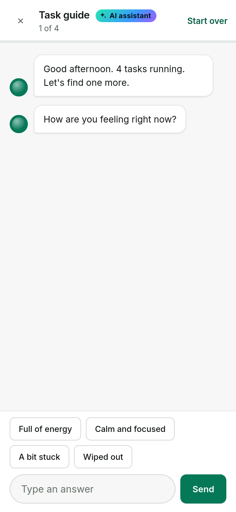
  &nbsp;
  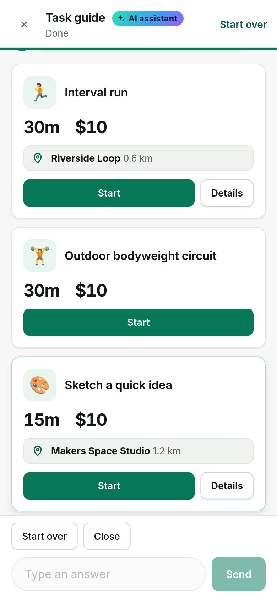
  &nbsp;
  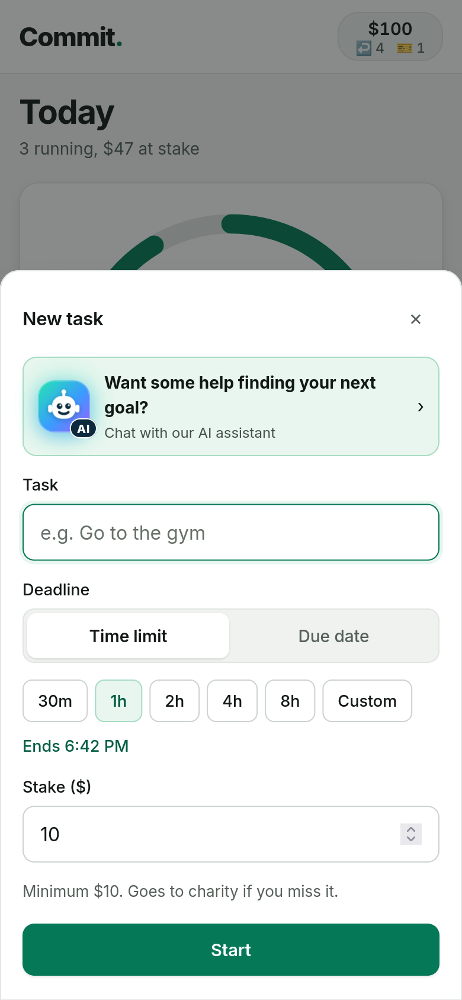

### 2. Partner offers

Alongside the AI's ideas, you'll see offers from local partners that make it easier to start: a free day pass at a gym, an intro yoga class at a promotional price, a free group run with a shoe fitting, a free audiobook, a discounted first meal box and more. Partners get their own colour and logo and are highlighted so you won't miss them. Claim an offer and it becomes a task, with a code to show when you arrive.

  
  &nbsp;
  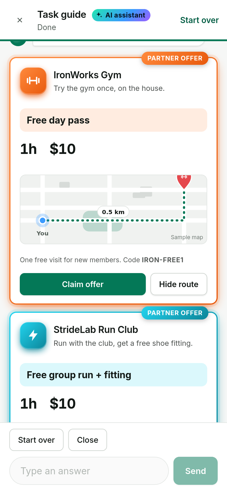

### 3. A map that shows you where to go

Every suggestion that involves going somewhere comes with a small map: you, the place, and the route between. Running tasks show the loop you'd run. Home tasks show where to pick up supplies. Tap **Details** or **Start** to see it.

  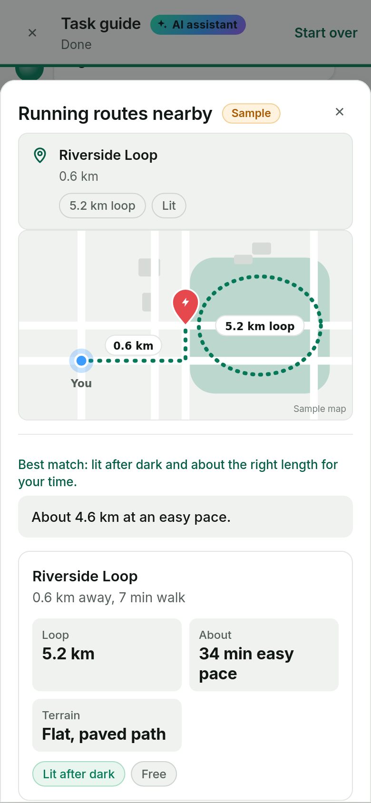

### 4. Photo proof, checked by AI

When you're done, you take a photo of the result: the gym floor, the finished plate, your open book. The app checks it looks like the real thing and tells you how confident it is. No honest photo, no completion.

  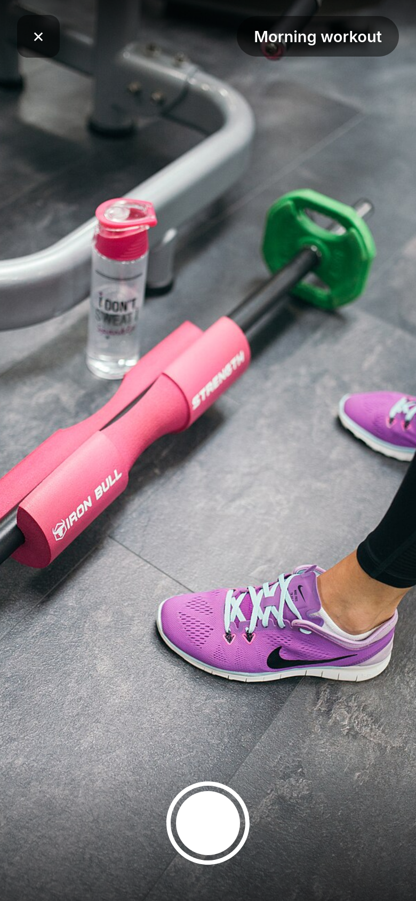
  &nbsp;
  

### 5. Real stakes, for a good cause

You choose a charity when you start, and misses go straight to it. Each charity shows how much has been raised towards its goal, so a missed task still does some good.

  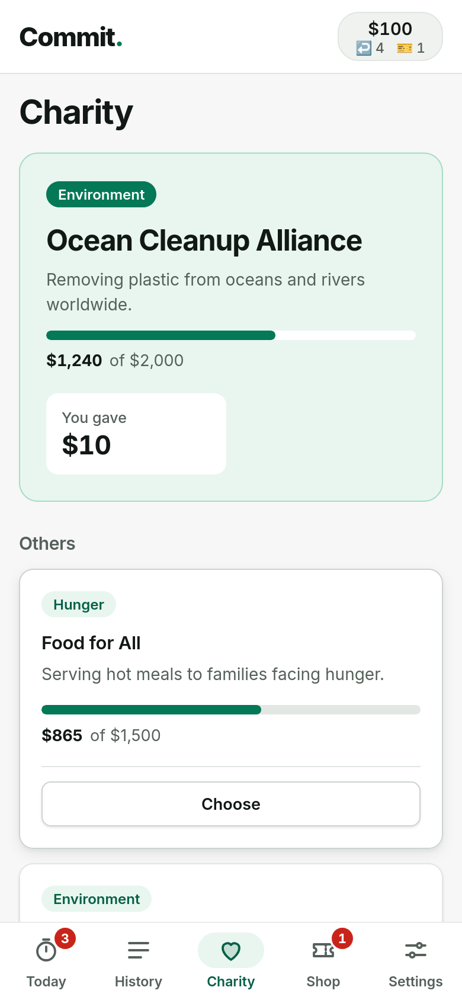

### 6. A safety net for real life

Life happens, so there are two kinds of ticket in the Shop:

- **Bail-out ticket:** truly blocked? Use one to clear a task. You keep your stake and nothing goes to charity.
- **One more try:** missed a deadline? Get another go. You get a few free every month, and can buy more.

Swipe between the two, or tap either counter to jump to it.

  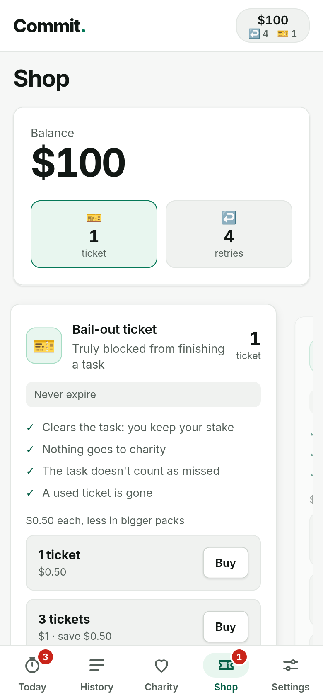
  &nbsp;
  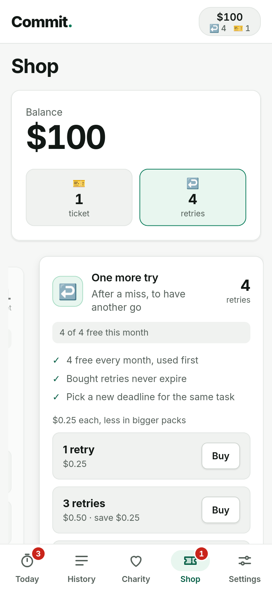

### 7. Keep track of your progress

A countdown for every task, and a history of everything you've completed, missed or cleared, with the proof photo for each one you finished.

  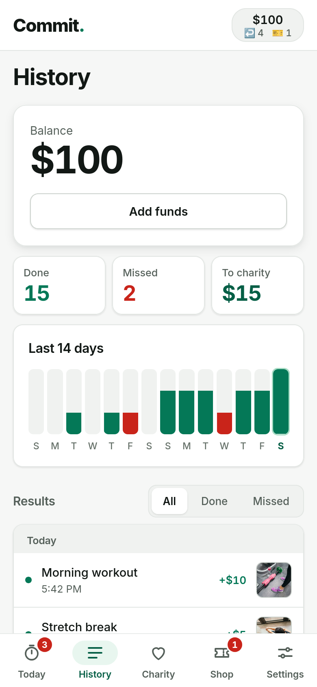

---

## Try it

Open the app and tap **Try the demo** on the sign-in screen. It comes filled with a sample account, some running tasks and a bit of history.

To run it on your computer, start it with `python app.py` and open <http://localhost:5002>. Open `phone.html` to see it inside a phone frame, where the camera is simulated with ready-made photos so you can try the whole proof flow.

> **A note on the demo.** This is a prototype. No real money moves, the partners and the maps are made-up samples, and the photo check is simulated. Everything you see is there to show how the finished app would feel.

---

## Photo credits

The sample proof photos come from Wikimedia Commons. Sources are listed in [img/proof/CREDITS.md](img/proof/CREDITS.md).
