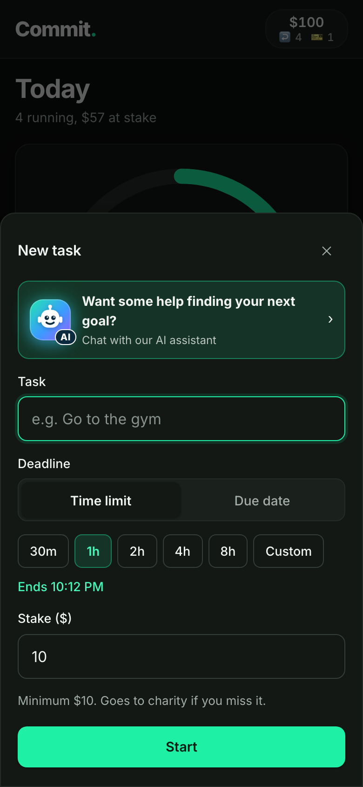
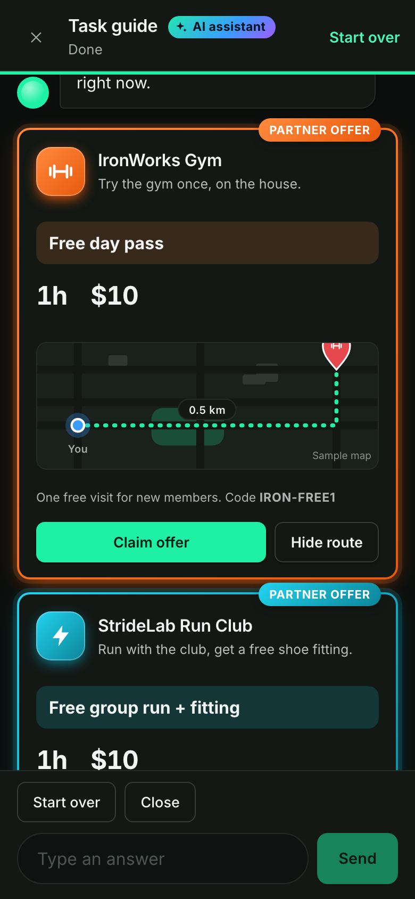
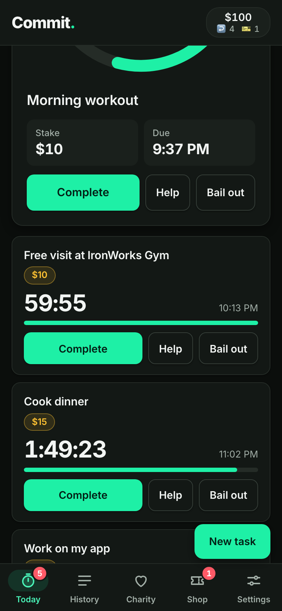
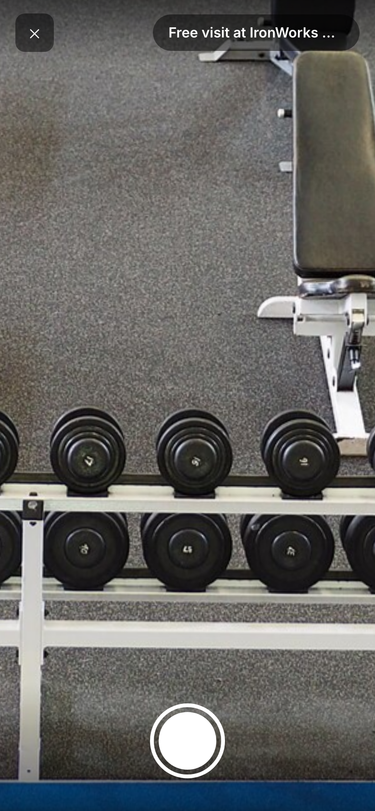
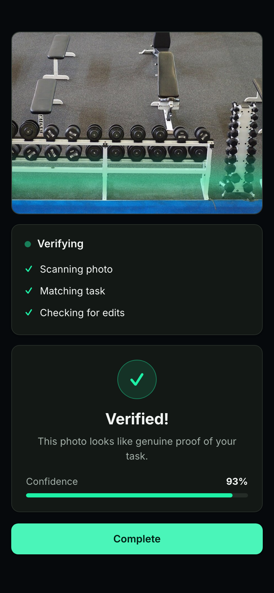

# WHERE YOU STARTED
### Option A · a 2:00 film for Commit. · time-travel version

*Logline:* A notification asks fit, happy ALEX, "Do you remember where you started?", and pulls him three years back into the same apartment on the night he made the choice that changed everything. He watches his past self make it, and cannot stop heckling.

**Tagline:** *Put your money where your goals are.*

---

## CHARACTERS

- **ALEX (NOW)**, a man in his early 30s. Fit, easy, glowing in golden light. A ghost in the flashback: he can talk and nobody can hear him.
- **ALEX (THEN)**, the same actor three years earlier. A baggy hoodie, tired eyes, a phone at 4%. Differs from his future self in energy, never in body.
- **DANI**, Alex's roommate and best friend. Deadpan, supportive underneath. Eats cereal at any hour.
- **THE REGULAR**, a huge, earnest gym regular. Takes everything seriously and is kind about it.

## LOCATIONS

The park (golden hour) · the apartment, three years ago · IronWorks Gym (night) · the park again.

## PROPS

A water bottle with a scuffed **Commit.** sticker · a gym tote with three jackets and a scarf hanging in it · the **Commit.** towel · Alex's phone · a membership email on the phone.

## SOUND

R&B groove in the present (Rhodes, round bass, finger-snap backbeat). **No music in the past** until Alex taps Start. One two-note **chime**, three times only.

---

## ACT 1 · PRESENT

### SHOT 1 · 0:00-0:05

**EXT. PARK, GOLDEN HOUR**

A low tracking shot at ground level. Bright running shoes slap a park path. Long golden shadows slide across the tarmac. Birdsong. The R&B groove starts on the first footfall.

### SHOT 2 · 0:05-0:11

ALEX jogs in profile, easy stride, shoulders loose. A water bottle swings in his hand; the **Commit.** sticker on it is scuffed from years of use. A runner passes. The two exchange a tiny two-finger salute.

> **ALEX** *(breathing, to himself)*
> Not bad for a guy who used to do cardio by looking for the remote.

### SHOT 3 · 0:11-0:15

Wide over the park. His phone buzzes in his armband. He slows to a walk, a little too dramatically, and pulls it out.

**SOUND:** the **chime (#1)**. The groove ducks and fades.

---

## ACT 2 · THE NOTIFICATION

### SHOT 4 · 0:15-0:22

**INSERT, LOCK SCREEN**

The **Commit.** banner on his lock screen:

> **Do you remember where you started?**
> *Your first task: "Free visit at IronWorks Gym" · 3 years ago · $10 at stake*

Silence, apart from the park.

### SHOT 5 · 0:22-0:28

**CLOSE-UP, ALEX**

"Oh no" eyebrows. Then, slowly, a curious smile. He taps the banner.

The camera pushes **through the glass of the phone**. The golden grade drains to cold as we go. A reversed chime and a rewinding *vwoop*.

---

## ACT 3 · THE PAST

### SHOT 6 · 0:28-0:38

**INT. APARTMENT, THREE YEARS AGO, SUNDAY 9:05 PM**

The same apartment, cold and slightly underexposed. No music, only room tone and a fridge hum. ALEX (THEN) is on the sofa in a baggy hoodie. DANI eats cereal at the counter. Behind the front door, a gym tote holds three jackets and a scarf.

ALEX (NOW) stands beside the sofa, still lit warm gold in a cold room.

> **ALEX (THEN)**
> Tomorrow. Gym. Six a.m.

ALEX (NOW) mouths it along with him, a half-beat early.

> **ALEX (NOW)** *(mouthing)*
> ...Six a.m.
>
> **DANI**
> You said that last Monday.
>
> **ALEX (THEN)**
> And I meant it last Monday.
>
> **ALEX (NOW)** *(to camera)*
> He did mean it. That's the worst part.

### SHOT 7 · 0:38-0:46

Two-shot. ALEX (THEN) waves a phone showing a gym membership email. DANI leans on the counter.

> **ALEX (THEN)**
> I pay thirty-nine dollars a month for a gym I've visited twice.
>
> **DANI**
> So make it cost something you can feel.
>
> **ALEX (NOW)**
> Dani's right. Dani is always right. It's exhausting.

### SHOT 8 · 0:46-0:56

**INSERT, THE AI CHAT**

ALEX (THEN) opens Commit and taps the banner *"Want some help finding your next goal?"*

*Insert 8a, 0:46. Tap on the AI banner.*

The chat asks how he feels. He taps **A bit stuck**. The reply appears:

*Insert 8b, 0:49. "Small starting points work best when you feel stuck."*

ALEX (NOW) leans in and reaches for the screen. His hand passes straight through it.

> **ALEX (THEN)**
> It gets me.
>
> **DANI**
> It's known you for four seconds.
>
> **ALEX (NOW)** *(leaning in)*
> Not "At home". Never "At home".

ALEX (THEN) taps **Out and about**.

> **ALEX (NOW)** *(exhaling)*
> ...Thank you.

### SHOT 9 · 0:56-1:04

**INSERT, THE OFFER**

The assistant offers a **Partner offer**: *IronWorks Gym, Free day pass, 1h, $10*, 0.5 km away.

*Insert 9a, 0:56. Tap on **Claim offer** at 0:58.*

*Insert 9b, 0:59. The goal fills in: "Free visit at IronWorks Gym".*

> **ALEX (THEN)**
> Free is my favourite price.

He presses **Start**.

**SOUND:** a cheerful *ding*. **The R&B groove returns, for the first time in the flashback.**

*Insert 9c, 1:01. The goal is live and counting down.*

> **DANI**
> You've got an hour.
>
> **ALEX (THEN)**
> It's Sunday night.
>
> **DANI**
> The timer doesn't know it's Sunday.

### SHOT 10 · 1:04-1:12

**INT. APARTMENT**

ALEX (THEN) tears the tote off the door. Three jackets and a scarf rain down. DANI catches one jacket without looking up from the cereal. ALEX (NOW) tries to catch a falling jacket and cannot.

> **ALEX (THEN)**
> That's been a coat hook since March.
>
> **DANI**
> It's gone to a good home.

### SHOT 11 · 1:12-1:22

**INT. IRONWORKS GYM, NIGHT**

A huge REGULAR is mid-set. ALEX (THEN) raises his phone at the dumbbell rack.

*Insert 11a, 1:12. The camera viewfinder.*

ALEX (NOW) covers his eyes.

> **REGULAR**
> Are you photographing the dumbbells?
>
> **ALEX (THEN)**
> It's for work.
>
> **REGULAR**
> What do you do?
>
> **ALEX (THEN)**
> Accountability.
>
> **ALEX (NOW)** *(through his fingers)*
> I still say that. I still say that.

---

## ACT 4 · SNAP BACK

### SHOT 12 · 1:22-1:28

**INSERT, VERIFIED**

*Insert 12a, 1:22. "Verified! 93%".*

**SOUND:** the **chime (#2)** rings in the gym, and the same chime pulls ALEX (NOW) forward. A whip-pan.

### SHOT 13 · 1:28-1:34

**EXT. PARK, GOLDEN HOUR**

Present again. ALEX is still holding his phone. He looks down at his legs and pats them, impressed. The dog barks somewhere. Birds return. One beat of silence.

> **ALEX**
> Sofa. Still the best seven percent.

### SHOT 14 · 1:34-1:40

**INSERT, HISTORY AND CHARITY**

The groove comes back.

*Insert 14a, 1:34. "Done 15", with the first win at the bottom of the list.*

*Insert 14b, 1:37. "You gave $10".*

> **ALEX** *(laughing)*
> I funded a turtle, and I became this.

---

## ACT 5 · NEW CHALLENGE

### SHOT 15 · 1:40-1:46

His phone buzzes again.

**INSERT, LOCK SCREEN**

> **Another round of leg day?**
> *IronWorks Gym · $10 at stake*  
> **[ Absolutely ]**

**SOUND:** the **chime (#3)**, brighter and shorter.

### SHOT 16 · 1:46-1:52

**MATCH CUT.** His running feet become feet stepping onto the gym floor. The REGULAR looks up and nods. ALEX walks in with the **Commit.** towel over his shoulder, like he owns the place.

> **REGULAR**
> Welcome back.
>
> **ALEX**
> I've never been here.
>
> **REGULAR**
> You were here three years ago. Photographing the dumbbells.

### SHOT 17 · 1:52-2:00

**END CARD**

The **Commit.** logo on black. The green dot pulses once.

> **Put your money where your goals are.**
> *Start your first task today.*

**SOUND:** the chime motif, one final note.

---

*Insert pack for this film: `video/inserts/option-a/` (9 screens, in order). Animatic: `video/films/option-a-where-you-started.mp4`.*
