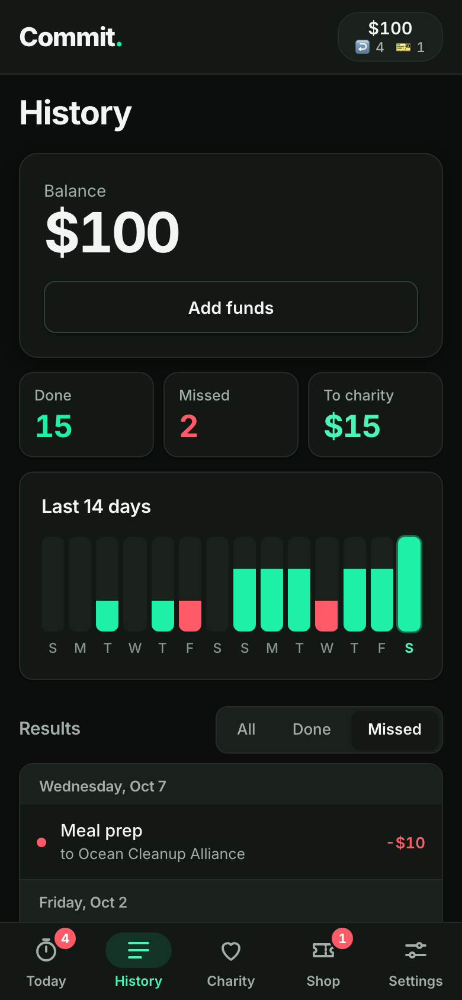
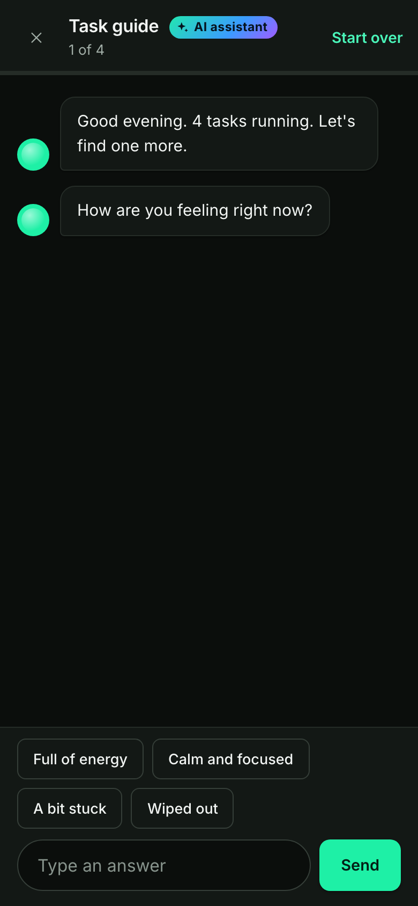
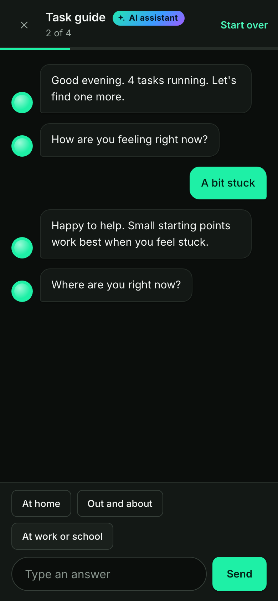
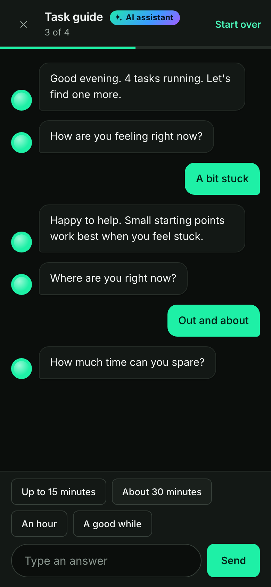
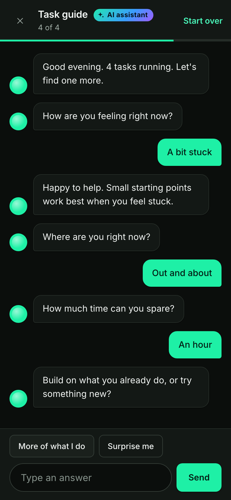
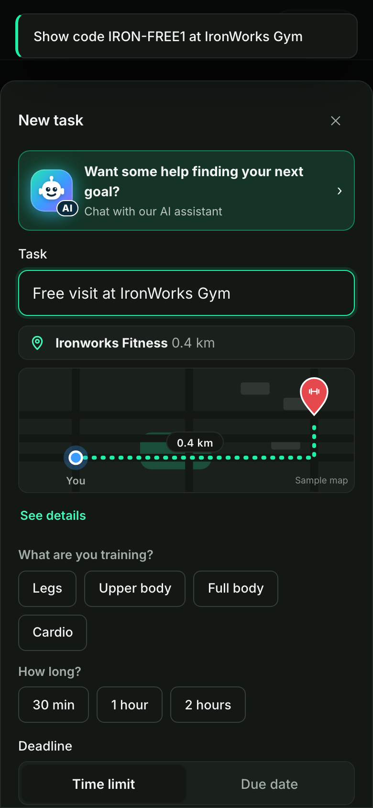
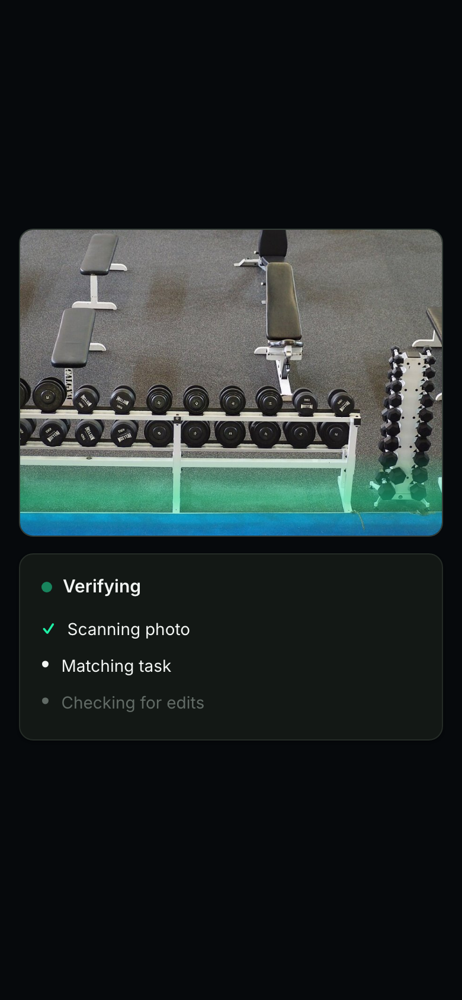
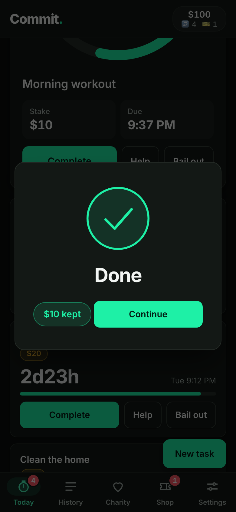
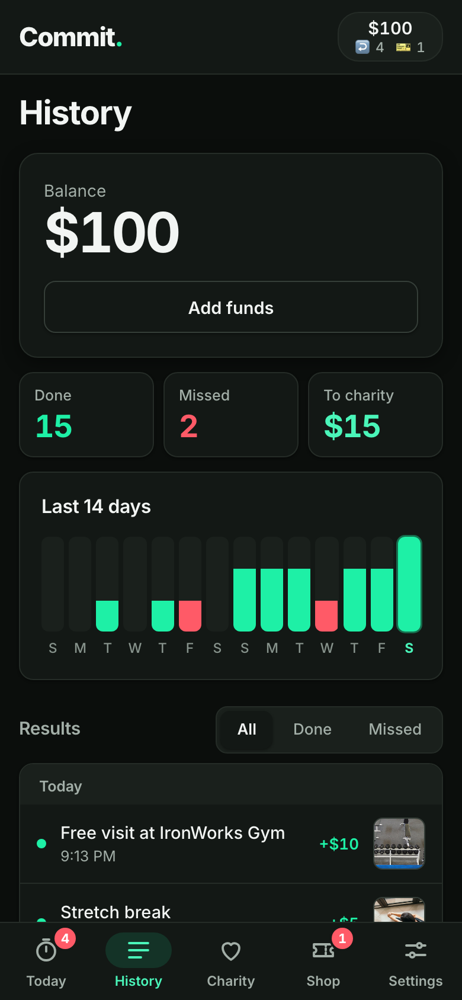
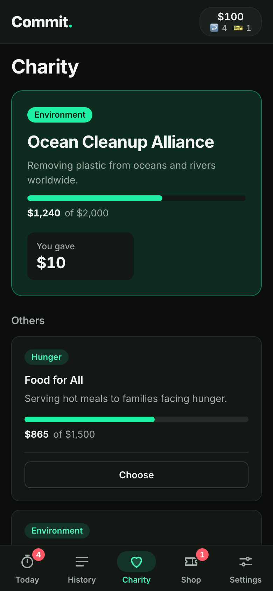

# STARTING MONDAY
### Option B · a 2:00 film for Commit. · realistic version

*Logline:* Everyone starts Monday. On a Sunday night, ALEX's roommate dares him to put ten dollars on it, and he finds out the timer doesn't know what day it is.

**Tagline:** *Put your money where your goals are.*

---

## CHARACTERS

- **ALEX**, a man in his early 30s. Likeable, overconfident, a gifted procrastinator. Always the hero of the joke, never the butt of it.
- **DANI**, Alex's roommate and best friend. Deadpan, supportive underneath. Eats cereal at any hour.
- **THE REGULAR**, a huge, earnest gym regular. Takes everything seriously and is kind about it.
- **FRONT DESK**, cheerful, one line.

## LOCATIONS

The apartment (Sunday 9:05 PM) · a night street and IronWorks Gym · a street at dawn (Monday 6:00 AM).

## PROPS

A gym tote hung behind the door with three jackets and a scarf in it · Alex's phone · a membership email on the phone · the **Commit.** towel · a bowl of cereal.

## SOUND

Before Alex taps Start: room tone, fridge hum, no music. **From the tap: a smooth R&B groove** (Rhodes, round bass, finger-snap backbeat). One two-note **chime**, three times: goal started (shot 7), photo verified (shot 11), Monday notification (shot 12).

---

## ACT 1 · SUNDAY, 9:05 PM

### SHOT 1 · 0:00-0:04

**INT. APARTMENT, SUNDAY 9:05 PM**

Title card: *Sunday, 9:05 PM*. A thumb scrolls gym ads on a phone. We pull back: ALEX is horizontal on the sofa.

> **ALEX**
> Tomorrow. Gym. Six a.m.

### SHOT 2 · 0:04-0:14

Wide. DANI eats cereal at the counter. Behind the front door, a gym tote holds three jackets and a scarf. It has been a coat hook for months.

> **DANI**
> You said that last Monday.
>
> **ALEX**
> And I meant it last Monday.
>
> **DANI**
> You've been starting Monday for three years. Monday's filed a complaint.

### SHOT 3 · 0:14-0:22

Two-shot. ALEX waves a phone showing a membership email.

> **ALEX**
> I pay thirty-nine dollars a month for a gym I've visited twice. It knows my card better than my face.
>
> **DANI**
> So make it cost something you can feel.

### SHOT 4 · 0:22-0:30

**INSERT, MISSED**

Alex opens Commit, taps History, taps **Missed**. A sample miss: *Meal prep, to Ocean Cleanup Alliance, -$10*.

*Insert 4a, 0:22. The Missed list.*

> **ALEX**
> I'm a philanthropist.
>
> **DANI**
> A reluctant one.
>
> **ALEX**
> Somewhere a turtle is eating well because of me.

---

## ACT 2 · THE CHAT

### SHOT 5 · 0:30-0:36

**INSERT, NEW TASK**

He taps **New task** and sees the AI banner.

*Insert 5a, 0:30. Tap on the AI banner at 0:33.*

> **ALEX**
> It's a chatbot. It can't judge me.
>
> **DANI**
> I can.

### SHOT 6 · 0:36-0:46

**INSERT, THE AI CHAT**

*Insert 6a, 0:36. "How are you feeling right now?"*

He taps **A bit stuck**. The reply: *"Happy to help. Small starting points work best when you feel stuck."*

*Insert 6b, 0:38.*

> **ALEX**
> It gets me.
>
> **DANI**
> It's known you for four seconds.

Quick cuts of his taps: **Out and about**, **An hour**, **More of what I do**.

 

*Inserts 6c (0:41) and 6d (0:43).*

### SHOT 7 · 0:46-0:55

**INSERT, THE OFFER**

The assistant offers a **Partner offer**: *IronWorks Gym, Free day pass, 1h, $10*, 0.5 km away.

*Insert 7a, 0:46. He hovers over **Claim offer** and taps at 0:48.*

> **ALEX**
> Free is my favourite price. Ten dollars at stake? That's exactly what I'd miss.

*Insert 7b, 0:49. "Free visit at IronWorks Gym".*

He presses **Start**.

**SOUND:** the **chime (#1)**. **The R&B groove drops in on the beat.**

*Insert 7c, 0:51. The timer is running.*

> **DANI** *(pointing at the timer)*
> You've got an hour.
>
> **ALEX**
> It's Sunday night.
>
> **DANI**
> The timer doesn't know that.

---

## ACT 3 · THE GYM

### SHOT 8 · 0:55-1:03

**INT. APARTMENT**

The scramble. ALEX tears the tote off the door. Three jackets and a scarf rain down. DANI catches one without looking up from the cereal. The **Commit.** towel hangs out of the tote.

> **ALEX**
> That's been a coat hook since March.
>
> **DANI**
> It's gone to a good home.

### SHOT 9 · 1:03-1:10

**EXT. NIGHT STREET / INT. IRONWORKS GYM, FRONT DESK**

A neon *IronWorks Gym* sign. Alex power-walks, timer in his hand. At the desk:

> **FRONT DESK**
> First time?
>
> **ALEX**
> In this building, yes.
>
> **FRONT DESK**
> Code?
>
> **ALEX**
> I-R-O-N, free, one.

### SHOT 10 · 1:10-1:18

**INT. IRONWORKS GYM, THE FLOOR**

A huge REGULAR is mid-set. ALEX gives him the "I belong here" nod. The Regular nods back. Alex raises his phone at the dumbbell rack.

*Insert 10a, 1:10. The camera viewfinder.*

> **REGULAR**
> Are you photographing the dumbbells?
>
> **ALEX**
> It's for work.
>
> **REGULAR**
> What do you do?
>
> **ALEX**
> Accountability.
>
> **REGULAR**
> ...Respect.

### SHOT 11 · 1:18-1:25

**INSERT, VERIFIED**

  

*Inserts 11a (1:18), 11b (1:20), 11c (1:23). Verifying, then **Verified! 93%**, then **Done, $10 kept**.*

**SOUND:** the **chime (#2)**.

Alex texts DANI. DANI replies.

> **DANI** *(text)*
> What's the other 7%?
>
> **ALEX** *(typing)*
> Sofa.

He lifts a dumbbell. The REGULAR spots him anyway.

> **REGULAR**
> I've got you.
>
> **ALEX**
> It's two kilos.
>
> **REGULAR**
> Still got you.

---

## ACT 4 · MONDAY, 6:00 AM

### SHOT 12 · 1:25-1:32

**EXT. STREET, BLUE DAWN**

ALEX in his stride, tote over his shoulder, the **Commit.** towel round his neck. His lock screen lights up.

> **Another round of leg day?**
> *IronWorks Gym · $10 at stake*  
> **[ Absolutely ]**

**SOUND:** the **chime (#3)**, brighter. The groove in full.

### SHOT 13 · 1:32-1:40

He taps. Above him a window opens: DANI, in a dressing gown.

> **DANI**
> It's six a.m. You said Monday.
>
> **ALEX**
> I started Sunday. Monday's just catching up.
>
> **DANI**
> ...That was good.
>
> **ALEX**
> I've been practising.

### SHOT 14 · 1:40-1:50

**INSERT, HISTORY AND CHARITY**

 

*Inserts 14a (1:40) and 14b (1:45). "Done 15", then "You gave $10".*

> **DANI** *(from the window)*
> Fifteen.
>
> **ALEX**
> And a turtle's very disappointed.

---

## ACT 5 · END CARD

### SHOT 15 · 1:50-2:00

The **Commit.** logo on black. The green dot pulses once.

> **Put your money where your goals are.**
> *Start your first task today.*

**SOUND:** the chime motif, one final note of the R&B groove.

---

*Insert pack for this film: `video/inserts/option-b/` (15 screens, in order). Animatic: `video/films/option-b-starting-monday.mp4`.*
